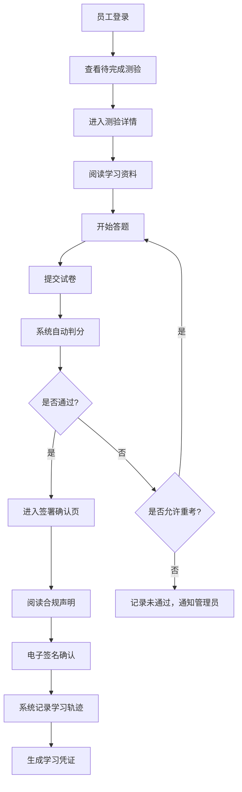
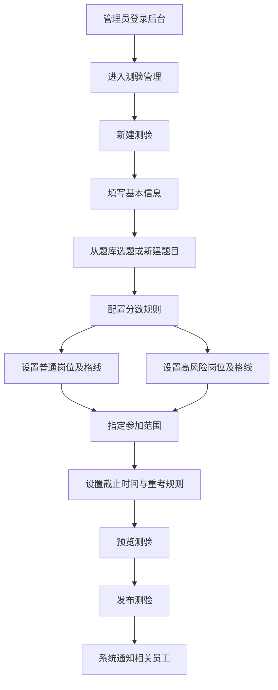

## 1. 产品概述
企业内控合规测评平台是面向企业法务、审计部门及全体员工的合规培训与考核系统。平台支持发布反舞弊、数据安全、采购红线等合规测验，员工完成学习与测验后签署电子确认，系统完整记录每位员工的学习轨迹与考核结果，确保合规可追溯、可审计。

- 核心目标：解决企业合规培训"谁学了、何时学、学了什么、成绩如何"的完整溯源问题
- 目标用户：法务/审计合规管理员、部门管理员、普通员工、高风险岗位员工

## 2. 核心 Features

### 2.1 User Roles
| Role | 注册方式 | 核心权限 |
|------|----------|----------|
| 超级管理员 | 系统预置 | 全系统管理、用户管理、角色分配 |
| 合规管理员（法务/审计） | 后台创建 | 发布测验、管理题库、查看全员学习记录、导出审计报告 |
| 部门管理员 | 后台创建 | 查看本部门员工学习进度、督促未完成员工 |
| 普通员工 | 统一身份认证/后台导入 | 参加测验、签署确认、查看个人学习记录 |
| 高风险岗位员工 | 后台标记岗位属性 | 必须达到指定及格线（如90分）方可通过，可多次重考 |

### 2.2 Feature Module
1. **登录页**：统一登录入口、角色识别、密码找回
2. **工作台仪表盘**：学习概览统计、待完成任务、快速入口
3. **测验中心**：可参加的测验列表、测验状态筛选、分类浏览
4. **测验详情页**：测验说明、学习资料、开始答题、成绩展示
5. **学习确认签署页**：电子签名确认、合规承诺阅读
6. **学习记录中心**：个人/全员学习档案、时间戳溯源、成绩详情
7. **测验管理后台**：题库管理、测验创建发布、分数规则配置、高风险岗位设置
8. **审计报表页**：按部门/岗位/时间维度统计、导出合规报告、未完成人员追踪

### 2.3 Page Details
| Page Name | Module Name | Feature description |
|-----------|-------------|---------------------|
| 登录页 | 登录表单 | 账号密码登录、记住登录态、错误提示 |
| 登录页 | 品牌展示 | 平台名称、合规标语、企业Logo区域 |
| 工作台 | 数据看板 | 总测验数、已完成数、通过率、待完成提醒 |
| 工作台 | 我的任务 | 待参加测验列表、截止日期、紧急程度标记 |
| 工作台 | 最近学习 | 最近完成的测验、签署时间、成绩 |
| 测验中心 | 测验列表 | 卡片式展示、分类标签（反舞弊/数据安全/采购红线）、状态徽章 |
| 测验中心 | 筛选搜索 | 按状态/分类/时间筛选、关键词搜索 |
| 测验详情页 | 测验信息 | 测验名称、发布部门、及格分数、截止时间、考试时长 |
| 测验详情页 | 学习资料 | 相关政策文档预览、下载 |
| 测验详情页 | 答题界面 | 单选/多选/判断题目、进度条、上一题/下一题、提交确认 |
| 测验详情页 | 成绩展示 | 得分、正确/错误题目回顾、是否通过、重考入口 |
| 学习确认签署页 | 合规声明 | 完整合规承诺文本、滚动阅读确认 |
| 学习确认签署页 | 电子签名 | 手写签名板或勾选确认、签署时间戳记录 |
| 学习记录中心 | 记录列表 | 按时间倒序展示所有学习记录、包含测验名、成绩、签署时间、IP地址 |
| 学习记录中心 | 记录详情 | 查看单次学习完整信息：开始时间、提交时间、答题详情、签名图像 |
| 测验管理后台 | 题库管理 | 题目增删改查、分类管理、难度标记 |
| 测验管理后台 | 测验发布 | 选择题目组卷、设置及格分、高风险岗位加分规则、指定参加范围、截止时间 |
| 测验管理后台 | 岗位管理 | 岗位列表、标记高风险岗位、设置对应及格线 |
| 审计报表页 | 统计概览 | 部门完成率柱状图、岗位通过率饼图、趋势折线图 |
| 审计报表页 | 明细报表 | 按员工/部门/测验维度的明细表、导出Excel/PDF |

## 3. Core Process

### 3.1 员工参加测验流程
员工登录系统后查看待完成任务，进入测验详情先阅读学习资料，开始答题，提交后系统自动判分。若通过则进入签署页，阅读合规声明后电子签名确认，系统记录完整学习轨迹；若未通过且允许重考，则可重新答题。

### 3.2 合规管理员发布测验流程
管理员登录后台，从题库选题或新建题目，配置测验规则（及格分、考试时长、截止时间），指定参加范围（全员/部门/岗位），对高风险岗位设置更高及格线，发布后系统自动通知相关员工。

## 4. User Interface Design

### 4.1 Design Style
- **主色调**：深蓝 (#0F2540) - 代表专业、信任、合规
- **辅助色**：
  - 金色 (#C9A962) - 代表严谨、权威，用于重要按钮和徽章
  - 警示红 (#C0392B) - 用于未通过、高风险提醒
  - 通过绿 (#27AE60) - 用于已通过、完成状态
- **中性色**： slate 系列灰色，确保信息层次清晰
- **按钮风格**：微立体圆角按钮，悬停有上浮阴影，点击有按压反馈
- **字体**：
  - 标题：Noto Serif SC（宋体风格，传递正式感）
  - 正文：Noto Sans SC（清晰易读）
  - 数据/数字：JetBrains Mono（等宽字体，确保审计数据对齐）
- **布局风格**：左右分栏布局（导航侧边栏 + 主内容区），卡片式模块，大量留白体现专业感
- **装饰元素**：细金线分隔、官方式印章纹理、微噪点背景增加质感

### 4.2 Page Design Overview
| Page Name | Module Name | UI Elements |
|-----------|-------------|-------------|
| 登录页 | 品牌展示区 | 深蓝渐变背景、金色品牌名、合规盾形图标、企业标语 |
| 登录页 | 表单区 | 白色半透明玻璃卡片、优雅输入框、金色主按钮 |
| 工作台 | 数据看板 | 4张数据卡片（带图标）、金色数字、趋势小箭头 |
| 工作台 | 任务列表 | 表格布局、状态彩色徽章、紧急任务红色高亮 |
| 测验中心 | 测验卡片 | 悬浮卡片、分类彩色标签、状态徽章、进度条 |
| 测验详情页 | 答题界面 | 大字号题目、选项卡片点击反馈、顶部进度条、倒计时 |
| 学习确认签署页 | 声明文本区 | 带边框的正式文档样式、编号条款、强制滚动阅读 |
| 学习确认签署页 | 签名区 | 画布式签名板、清除按钮、确认按钮、时间戳预览 |
| 学习记录中心 | 记录列表 | 时间轴布局、每条记录带详细元数据、可展开详情 |
| 审计报表页 | 图表区 | 柱状图/饼图组合、金色点缀、悬停显示详情 |
| 审计报表页 | 数据表格 | 斑马纹、可排序、导出按钮 |

### 4.3 Responsiveness
- **设计优先级**：Desktop-first（企业级系统主要在办公电脑使用）
- **断点适配**：
  - ≥1280px：标准三栏布局（侧边导航+内容+辅助面板）
  - 1024-1280px：双栏布局（侧边导航+内容）
  - 768-1024px：折叠侧边导航为图标模式
  - <768px：顶部汉堡菜单，单列流式布局
- **触摸优化**：移动端签名板支持触摸手势，按钮最小尺寸44px
