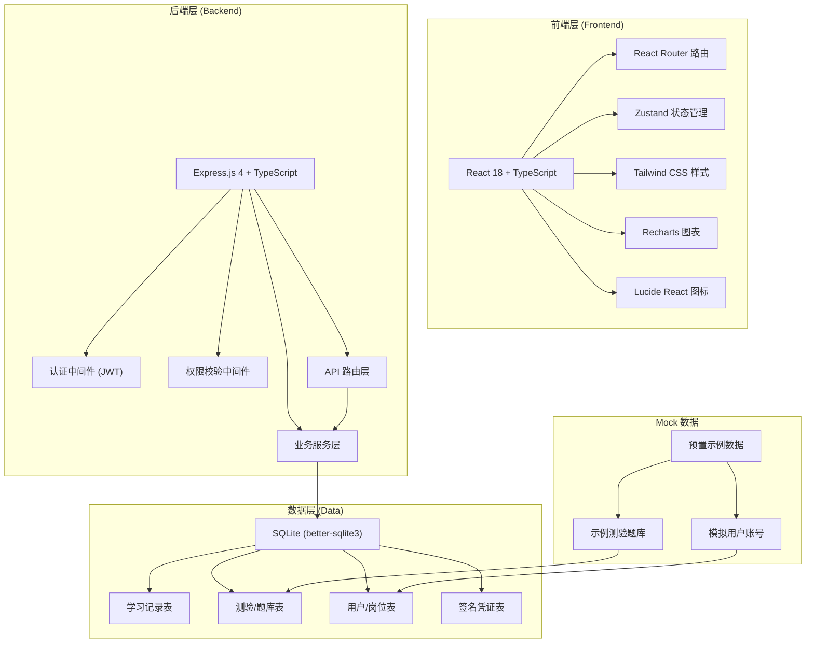
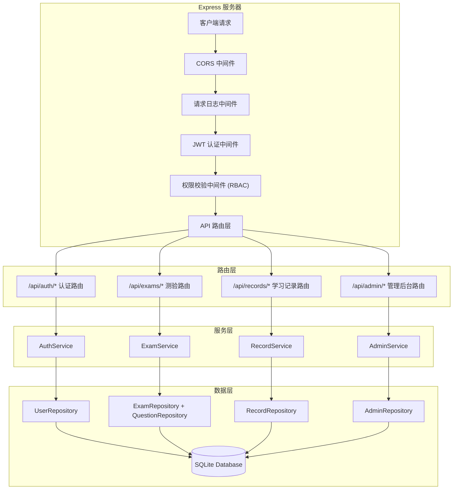
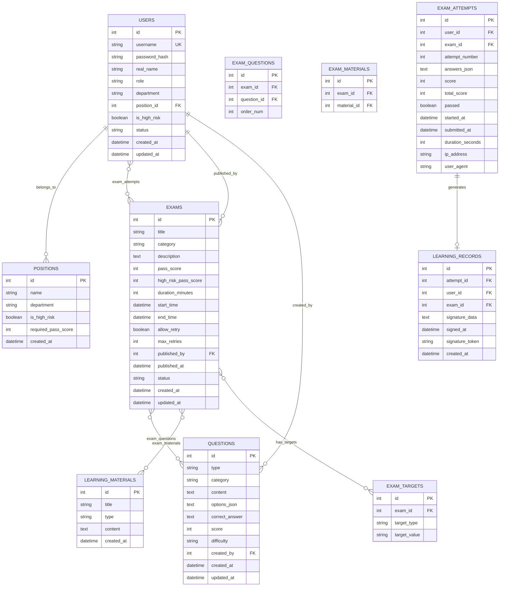

## 1. 架构设计



## 2. 技术说明
- **前端**: React@18 + TypeScript + Vite + TailwindCSS@3 + Zustand + React Router DOM + Recharts + Lucide React
- **后端**: Express.js@4 + TypeScript + better-sqlite3 + JWT 认证
- **初始化工具**: vite-init (react-express-ts 模板)
- **数据库**: SQLite (轻量级，便于 Demo 运行，生产可迁移至 PostgreSQL)
- **认证**: JWT Token + 角色权限控制
- **电子签名**: Canvas API 手写签名 + Base64 存储
- **审计溯源**: 所有操作记录 IP、时间戳、User-Agent

## 3. 路由定义

| Route | 页面名称 | 权限要求 | 用途说明 |
|-------|----------|----------|----------|
| /login | 登录页 | 公开 | 用户登录入口 |
| /dashboard | 工作台仪表盘 | 已登录 | 学习概览、待办任务、快捷入口 |
| /exams | 测验中心 | 已登录 | 可参加测验列表、筛选搜索 |
| /exams/:id | 测验详情/答题页 | 已登录 | 查看测验信息、答题、查看成绩 |
| /exams/:id/sign | 学习确认签署页 | 已通过测验 | 阅读合规声明、电子签名确认 |
| /records | 学习记录中心 | 已登录 | 个人学习记录列表、时间戳溯源 |
| /records/:id | 学习记录详情 | 已登录 | 单次学习完整档案、签名查看 |
| /admin/exams | 测验管理后台 | 合规管理员 | 测验列表、发布管理 |
| /admin/exams/new | 新建测验页 | 合规管理员 | 创建测验、组卷、配置规则 |
| /admin/questions | 题库管理 | 合规管理员 | 题目增删改查、分类管理 |
| /admin/positions | 岗位管理 | 超级管理员 | 岗位列表、高风险标记、及格线设置 |
| /admin/users | 用户管理 | 超级管理员 | 用户列表、角色分配、岗位关联 |
| /admin/reports | 审计报表页 | 合规管理员 | 统计图表、明细报表、导出功能 |

## 4. API 定义

### 4.1 认证接口
```typescript
// POST /api/auth/login
interface LoginRequest {
  username: string;
  password: string;
}
interface LoginResponse {
  token: string;
  user: {
    id: number;
    username: string;
    realName: string;
    role: 'super_admin' | 'compliance_officer' | 'dept_manager' | 'employee';
    positionId: number | null;
    department: string;
    isHighRisk: boolean;
  };
}

// POST /api/auth/logout
interface LogoutResponse {
  success: boolean;
}

// GET /api/auth/me
interface CurrentUserResponse {
  // 同 LoginResponse.user
}
```

### 4.2 测验接口
```typescript
// GET /api/exams - 获取测验列表
interface ExamListQuery {
  status?: 'all' | 'pending' | 'in_progress' | 'completed' | 'expired';
  category?: string;
  page?: number;
  pageSize?: number;
}
interface ExamListItem {
  id: number;
  title: string;
  category: 'anti_fraud' | 'data_security' | 'procurement' | 'other';
  categoryName: string;
  description: string;
  passScore: number;
  highRiskPassScore: number;
  duration: number;
  totalQuestions: number;
  totalScore: number;
  startTime: string;
  endTime: string;
  allowRetry: boolean;
  maxRetries: number;
  publishedBy: string;
  publishedAt: string;
  userStatus: 'not_started' | 'in_progress' | 'passed' | 'failed' | 'expired';
  userScore: number | null;
  userAttempts: number;
}

// GET /api/exams/:id - 获取测验详情
interface ExamDetail extends ExamListItem {
  learningMaterials: Array<{
    id: number;
    title: string;
    type: 'pdf' | 'doc' | 'text';
    content?: string;
  }>;
}

// GET /api/exams/:id/questions - 获取测验题目（答题时调用）
interface ExamQuestion {
  id: number;
  type: 'single' | 'multiple' | 'judge';
  content: string;
  score: number;
  options: Array<{ key: string; value: string }>;
}

// POST /api/exams/:id/submit - 提交答案
interface SubmitExamRequest {
  answers: Array<{ questionId: number; answer: string | string[] }>;
  startedAt: string;
}
interface SubmitExamResponse {
  attemptId: number;
  score: number;
  totalScore: number;
  passScore: number;
  passed: boolean;
  correctCount: number;
  totalQuestions: number;
  details: Array<{
    questionId: number;
    correct: boolean;
    userAnswer: string | string[];
    correctAnswer: string | string[];
    score: number;
    userScore: number;
  }>;
  submittedAt: string;
  canRetry: boolean;
  remainingRetries: number;
}
```

### 4.3 学习记录接口
```typescript
// GET /api/records - 获取学习记录列表
interface RecordListQuery {
  userId?: number;
  examId?: number;
  startDate?: string;
  endDate?: string;
  page?: number;
  pageSize?: number;
}
interface LearningRecord {
  id: number;
  attemptId: number;
  userId: number;
  username: string;
  realName: string;
  department: string;
  positionName: string;
  isHighRiskPosition: boolean;
  examId: number;
  examTitle: string;
  examCategory: string;
  examCategoryName: string;
  score: number;
  totalScore: number;
  passScore: number;
  passed: boolean;
  startedAt: string;
  submittedAt: string;
  durationSeconds: number;
  signedAt: string | null;
  signature: string | null;
  ipAddress: string;
  userAgent: string;
  attemptNumber: number;
}

// GET /api/records/:id - 获取学习记录详情
interface LearningRecordDetail extends LearningRecord {
  answerDetails: Array<{
    questionId: number;
    questionContent: string;
    questionType: string;
    correct: boolean;
    userAnswer: string | string[];
    correctAnswer: string | string[];
    options: Array<{ key: string; value: string }>;
    score: number;
    userScore: number;
  }>;
}
```

### 4.4 电子签名接口
```typescript
// POST /api/records/:id/sign - 签署学习确认
interface SignRecordRequest {
  signature: string;
  declarationRead: boolean;
}
interface SignRecordResponse {
  success: boolean;
  signedAt: string;
  signatureToken: string;
}

// GET /api/records/:id/signature - 获取签名图像
interface SignatureResponse {
  signature: string;
  signedAt: string;
  realName: string;
}
```

### 4.5 管理后台接口
```typescript
// GET /api/admin/questions - 题库列表
// POST /api/admin/questions - 新建题目
// PUT /api/admin/questions/:id - 编辑题目
// DELETE /api/admin/questions/:id - 删除题目
interface Question {
  id: number;
  type: 'single' | 'multiple' | 'judge';
  category: string;
  content: string;
  options: Array<{ key: string; value: string }>;
  correctAnswer: string | string[];
  score: number;
  difficulty: 'easy' | 'medium' | 'hard';
  createdAt: string;
}

// GET /api/admin/exams - 管理端测验列表
// POST /api/admin/exams - 发布测验
// PUT /api/admin/exams/:id - 编辑测验
interface ExamCreateRequest {
  title: string;
  category: string;
  description: string;
  questionIds: number[];
  passScore: number;
  highRiskPassScore: number;
  duration: number;
  startTime: string;
  endTime: string;
  allowRetry: boolean;
  maxRetries: number;
  targetDepartments: string[];
  targetPositionIds: number[];
  learningMaterialIds: number[];
}

// GET /api/admin/users - 用户列表
// POST /api/admin/users - 创建用户
interface User {
  id: number;
  username: string;
  realName: string;
  role: string;
  department: string;
  positionId: number | null;
  positionName: string | null;
  isHighRisk: boolean;
  status: 'active' | 'disabled';
}

// GET /api/admin/positions - 岗位列表
// POST /api/admin/positions - 创建岗位
interface Position {
  id: number;
  name: string;
  department: string;
  isHighRisk: boolean;
  requiredPassScore: number;
}

// GET /api/admin/reports/summary - 报表统计数据
interface ReportSummary {
  totalExams: number;
  totalParticipants: number;
  completionRate: number;
  passRate: number;
  byDepartment: Array<{ name: string; total: number; completed: number; passed: number }>;
  byCategory: Array<{ name: string; total: number; completed: number; passed: number }>;
  byRiskLevel: { highRisk: { total: number; passed: number }; normal: { total: number; passed: number } };
  trend: Array<{ date: string; completed: number; passed: number }>;
}

// GET /api/admin/reports/export - 导出报表 (Excel/PDF)
```

## 5. 服务器架构图



## 6. 数据模型

### 6.1 数据模型定义 (ER 图)



### 6.2 数据定义语言 (DDL)

```sql
-- 用户表
CREATE TABLE users (
  id INTEGER PRIMARY KEY AUTOINCREMENT,
  username VARCHAR(50) UNIQUE NOT NULL,
  password_hash VARCHAR(255) NOT NULL,
  real_name VARCHAR(50) NOT NULL,
  role VARCHAR(20) NOT NULL DEFAULT 'employee',
  department VARCHAR(100) NOT NULL,
  position_id INTEGER,
  is_high_risk BOOLEAN NOT NULL DEFAULT 0,
  status VARCHAR(20) NOT NULL DEFAULT 'active',
  created_at DATETIME NOT NULL DEFAULT CURRENT_TIMESTAMP,
  updated_at DATETIME NOT NULL DEFAULT CURRENT_TIMESTAMP,
  FOREIGN KEY (position_id) REFERENCES positions(id)
);

-- 岗位表
CREATE TABLE positions (
  id INTEGER PRIMARY KEY AUTOINCREMENT,
  name VARCHAR(100) NOT NULL,
  department VARCHAR(100) NOT NULL,
  is_high_risk BOOLEAN NOT NULL DEFAULT 0,
  required_pass_score INTEGER NOT NULL DEFAULT 80,
  created_at DATETIME NOT NULL DEFAULT CURRENT_TIMESTAMP
);

-- 题库表
CREATE TABLE questions (
  id INTEGER PRIMARY KEY AUTOINCREMENT,
  type VARCHAR(20) NOT NULL,
  category VARCHAR(50) NOT NULL,
  content TEXT NOT NULL,
  options_json TEXT NOT NULL,
  correct_answer TEXT NOT NULL,
  score INTEGER NOT NULL DEFAULT 10,
  difficulty VARCHAR(20) NOT NULL DEFAULT 'medium',
  created_by INTEGER NOT NULL,
  created_at DATETIME NOT NULL DEFAULT CURRENT_TIMESTAMP,
  updated_at DATETIME NOT NULL DEFAULT CURRENT_TIMESTAMP,
  FOREIGN KEY (created_by) REFERENCES users(id)
);

-- 测验表
CREATE TABLE exams (
  id INTEGER PRIMARY KEY AUTOINCREMENT,
  title VARCHAR(200) NOT NULL,
  category VARCHAR(50) NOT NULL,
  description TEXT,
  pass_score INTEGER NOT NULL DEFAULT 60,
  high_risk_pass_score INTEGER NOT NULL DEFAULT 90,
  duration_minutes INTEGER NOT NULL DEFAULT 60,
  start_time DATETIME NOT NULL,
  end_time DATETIME NOT NULL,
  allow_retry BOOLEAN NOT NULL DEFAULT 0,
  max_retries INTEGER NOT NULL DEFAULT 0,
  published_by INTEGER NOT NULL,
  published_at DATETIME NOT NULL DEFAULT CURRENT_TIMESTAMP,
  status VARCHAR(20) NOT NULL DEFAULT 'draft',
  created_at DATETIME NOT NULL DEFAULT CURRENT_TIMESTAMP,
  updated_at DATETIME NOT NULL DEFAULT CURRENT_TIMESTAMP,
  FOREIGN KEY (published_by) REFERENCES users(id)
);

-- 测验-题目关联表
CREATE TABLE exam_questions (
  id INTEGER PRIMARY KEY AUTOINCREMENT,
  exam_id INTEGER NOT NULL,
  question_id INTEGER NOT NULL,
  order_num INTEGER NOT NULL DEFAULT 0,
  FOREIGN KEY (exam_id) REFERENCES exams(id),
  FOREIGN KEY (question_id) REFERENCES questions(id)
);

-- 学习资料表
CREATE TABLE learning_materials (
  id INTEGER PRIMARY KEY AUTOINCREMENT,
  title VARCHAR(200) NOT NULL,
  type VARCHAR(20) NOT NULL DEFAULT 'text',
  content TEXT NOT NULL,
  created_at DATETIME NOT NULL DEFAULT CURRENT_TIMESTAMP
);

-- 测验-资料关联表
CREATE TABLE exam_materials (
  id INTEGER PRIMARY KEY AUTOINCREMENT,
  exam_id INTEGER NOT NULL,
  material_id INTEGER NOT NULL,
  FOREIGN KEY (exam_id) REFERENCES exams(id),
  FOREIGN KEY (material_id) REFERENCES learning_materials(id)
);

-- 测验参加范围表
CREATE TABLE exam_targets (
  id INTEGER PRIMARY KEY AUTOINCREMENT,
  exam_id INTEGER NOT NULL,
  target_type VARCHAR(20) NOT NULL,
  target_value VARCHAR(100) NOT NULL,
  FOREIGN KEY (exam_id) REFERENCES exams(id)
);

-- 测验答题记录表
CREATE TABLE exam_attempts (
  id INTEGER PRIMARY KEY AUTOINCREMENT,
  user_id INTEGER NOT NULL,
  exam_id INTEGER NOT NULL,
  attempt_number INTEGER NOT NULL DEFAULT 1,
  answers_json TEXT,
  score INTEGER,
  total_score INTEGER,
  passed BOOLEAN,
  started_at DATETIME NOT NULL,
  submitted_at DATETIME,
  duration_seconds INTEGER,
  ip_address VARCHAR(50),
  user_agent TEXT,
  FOREIGN KEY (user_id) REFERENCES users(id),
  FOREIGN KEY (exam_id) REFERENCES exams(id)
);

-- 学习确认记录表（审计核心）
CREATE TABLE learning_records (
  id INTEGER PRIMARY KEY AUTOINCREMENT,
  attempt_id INTEGER NOT NULL UNIQUE,
  user_id INTEGER NOT NULL,
  exam_id INTEGER NOT NULL,
  signature_data TEXT,
  signed_at DATETIME,
  signature_token VARCHAR(100) UNIQUE,
  created_at DATETIME NOT NULL DEFAULT CURRENT_TIMESTAMP,
  FOREIGN KEY (attempt_id) REFERENCES exam_attempts(id),
  FOREIGN KEY (user_id) REFERENCES users(id),
  FOREIGN KEY (exam_id) REFERENCES exams(id)
);

-- 索引
CREATE INDEX idx_users_role ON users(role);
CREATE INDEX idx_users_department ON users(department);
CREATE INDEX idx_exams_category ON exams(category);
CREATE INDEX idx_exams_status ON exams(status);
CREATE INDEX idx_questions_category ON questions(category);
CREATE INDEX idx_exam_attempts_user ON exam_attempts(user_id);
CREATE INDEX idx_exam_attempts_exam ON exam_attempts(exam_id);
CREATE INDEX idx_learning_records_user ON learning_records(user_id);
CREATE INDEX idx_learning_records_exam ON learning_records(exam_id);
CREATE INDEX idx_learning_records_signed_at ON learning_records(signed_at);
```

### 6.3 初始 Mock 数据

```sql
-- 预置岗位
INSERT INTO positions (name, department, is_high_risk, required_pass_score) VALUES
('采购经理', '采购部', 1, 90),
('采购专员', '采购部', 1, 90),
('财务总监', '财务部', 1, 90),
('出纳', '财务部', 1, 85),
('数据管理员', '技术部', 1, 90),
('销售经理', '销售部', 0, 60),
('人事专员', '人力资源部', 0, 60),
('行政文员', '行政部', 0, 60);

-- 预置用户（密码均为 123456，实际为 bcrypt hash）
INSERT INTO users (username, password_hash, real_name, role, department, position_id, is_high_risk) VALUES
('admin', '$2b$10$N9qo8uLOickgx2ZMRZoMyeIjZAgcfl7p92ldGxad68LJZdL17lhWy', '超级管理员', 'super_admin', '总裁办', NULL, 0),
('compliance01', '$2b$10$N9qo8uLOickgx2ZMRZoMyeIjZAgcfl7p92ldGxad68LJZdL17lhWy', '张法务', 'compliance_officer', '法务部', NULL, 0),
('audit01', '$2b$10$N9qo8uLOickgx2ZMRZoMyeIjZAgcfl7p92ldGxad68LJZdL17lhWy', '李审计', 'compliance_officer', '审计部', NULL, 0),
('dept_manager', '$2b$10$N9qo8uLOickgx2ZMRZoMyeIjZAgcfl7p92ldGxad68LJZdL17lhWy', '王主任', 'dept_manager', '技术部', NULL, 0),
('employee01', '$2b$10$N9qo8uLOickgx2ZMRZoMyeIjZAgcfl7p92ldGxad68LJZdL17lhWy', '赵采购', 'employee', '采购部', 1, 1),
('employee02', '$2b$10$N9qo8uLOickgx2ZMRZoMyeIjZAgcfl7p92ldGxad68LJZdL17lhWy', '钱数据', 'employee', '技术部', 5, 1),
('employee03', '$2b$10$N9qo8uLOickgx2ZMRZoMyeIjZAgcfl7p92ldGxad68LJZdL17lhWy', '孙销售', 'employee', '销售部', 6, 0),
('employee04', '$2b$10$N9qo8uLOickgx2ZMRZoMyeIjZAgcfl7p92ldGxad68LJZdL17lhWy', '周行政', 'employee', '行政部', 8, 0);

-- 预置题库（反舞弊）
INSERT INTO questions (type, category, content, options_json, correct_answer, score, difficulty, created_by) VALUES
('single', 'anti_fraud', '公司员工在业务活动中接受供应商提供的礼品，价值不得超过多少元？', '[{"key":"A","value":"100元"},{"key":"B","value":"200元"},{"key":"C","value":"500元"},{"key":"D","value":"1000元"}]', 'B', 10, 'easy', 2),
('judge', 'anti_fraud', '员工可以利用职务便利为亲属经营的活动谋取利益。', '[{"key":"A","value":"正确"},{"key":"B","value":"错误"}]', 'B', 10, 'easy', 2),
('multiple', 'anti_fraud', '以下哪些行为属于公司禁止的舞弊行为？', '[{"key":"A","value":"虚报差旅费"},{"key":"B","value":"收受供应商回扣"},{"key":"C","value":"泄露公司商业秘密"},{"key":"D","value":"按规定流程采购物资"}]', '["A","B","C"]', 15, 'medium', 2),
('single', 'data_security', '公司内部的机密数据在传输过程中应当采用什么方式？', '[{"key":"A","value":"明文传输"},{"key":"B","value":"加密传输"},{"key":"C","value":"压缩传输"},{"key":"D","value":"分片传输"}]', 'B', 10, 'easy', 2),
('judge', 'data_security', '员工离职后，可以保留其在工作期间接触到的客户数据用于个人用途。', '[{"key":"A","value":"正确"},{"key":"B","value":"错误"}]', 'B', 10, 'easy', 2),
('multiple', 'data_security', '处理客户个人信息时，应当遵守以下哪些原则？', '[{"key":"A","value":"合法正当"},{"key":"B","value":"最小必要"},{"key":"C","value":"知情同意"},{"key":"D","value":"随意使用"}]', '["A","B","C"]', 15, 'medium', 2),
('single', 'procurement', '采购金额达到多少需要进行公开招标？', '[{"key":"A","value":"1万元以上"},{"key":"B","value":"5万元以上"},{"key":"C","value":"10万元以上"},{"key":"D","value":"50万元以上"}]', 'D', 10, 'medium', 2),
('judge', 'procurement', '紧急采购可以不经过审批直接下单，事后再补流程。', '[{"key":"A","value":"正确"},{"key":"B","value":"错误"}]', 'B', 10, 'easy', 2),
('multiple', 'procurement', '采购红线包括以下哪些内容？', '[{"key":"A","value":"拆分合同规避招标"},{"key":"B","value":"指定供应商"},{"key":"C","value":"与供应商私下接触"},{"key":"D","value":"三家以上比价"}]', '["A","B","C"]', 15, 'hard', 2);

-- 预置学习资料
INSERT INTO learning_materials (title, type, content) VALUES
('反舞弊管理办法', 'text', '# 反舞弊管理办法\n\n## 第一章 总则\n第一条 为预防和查处舞弊行为，维护公司合法权益，根据相关法律法规，结合公司实际，制定本办法。\n\n## 第二章 禁止行为\n第二条 公司禁止任何形式的舞弊行为，包括但不限于：\n（一）贪污、受贿、挪用公款；\n（二）虚报费用、伪造票据；\n（三）利用职务便利为本人或他人谋取不正当利益；\n（四）泄露公司商业秘密；\n（五）其他损害公司利益的行为。'),
('数据安全管理制度', 'text', '# 数据安全管理制度\n\n## 第一章 总则\n第一条 为加强公司数据安全管理，保障数据合法、合规使用，根据《中华人民共和国数据安全法》《中华人民共和国个人信息保护法》等法律法规，制定本制度。\n\n## 第二章 数据分类分级\n第二条 公司数据按照重要程度分为：公开数据、内部数据、敏感数据、核心数据。\n\n## 第三章 数据处理规范\n第三条 处理个人信息应当遵循合法、正当、必要原则，取得个人同意。'),
('采购红线管理规定', 'text', '# 采购红线管理规定\n\n## 第一章 总则\n第一条 为规范采购行为，防范采购风险，明确采购红线，制定本规定。\n\n## 第二章 采购红线\n第二条 严禁以下采购行为：\n（一）拆分合同规避招标或审批程序；\n（二）指定或变相指定供应商；\n（三）与供应商私下接触、收受利益；\n（四）采购质次价高商品或服务；\n（五）其他违反采购制度的行为。');

-- 预置测验
INSERT INTO exams (title, category, description, pass_score, high_risk_pass_score, duration_minutes, start_time, end_time, allow_retry, max_retries, published_by, status) VALUES
('2026年度反舞弊合规测验', 'anti_fraud', '本测验考查员工对公司反舞弊政策的理解和掌握程度，所有员工必须参加。', 60, 90, 45, '2026-01-01 00:00:00', '2026-12-31 23:59:59', 1, 3, 2, 'published'),
('2026年度数据安全合规测验', 'data_security', '本测验考查员工对数据安全法规和公司制度的掌握，涉及客户数据的员工必须参加。', 60, 90, 45, '2026-01-01 00:00:00', '2026-12-31 23:59:59', 1, 3, 2, 'published'),
('2026年度采购红线合规测验', 'procurement', '本测验考查员工对采购红线制度的掌握，采购部门及相关部门员工必须参加。', 70, 95, 60, '2026-01-01 00:00:00', '2026-12-31 23:59:59', 1, 5, 2, 'published');

-- 预置测验题目关联
INSERT INTO exam_questions (exam_id, question_id, order_num) VALUES
(1, 1, 1), (1, 2, 2), (1, 3, 3),
(2, 4, 1), (2, 5, 2), (2, 6, 3),
(3, 7, 1), (3, 8, 2), (3, 9, 3);

-- 预置测验学习资料关联
INSERT INTO exam_materials (exam_id, material_id) VALUES
(1, 1), (2, 2), (3, 3);

-- 预置测验参加范围
INSERT INTO exam_targets (exam_id, target_type, target_value) VALUES
(1, 'department', 'all'),
(2, 'department', 'all'),
(3, 'department', '采购部'),
(3, 'position', '5');
```
